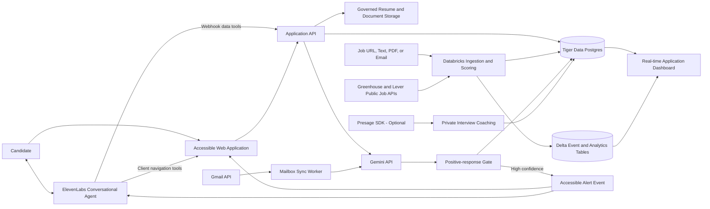

# Automated Job Application and Response Intelligence Platform

## 1. Purpose

This document describes a platform that helps a candidate discover relevant jobs, prepare truthful application materials, review and submit applications, monitor employer email responses, and operate the experience through an accessible ElevenLabs conversational interface. The same interface can announce high-confidence positive responses and begin job-specific interview preparation.

The system is designed for a hackathon prototype. It prioritizes a coherent user experience and meaningful sponsor integrations over using every available technology.

## 2. Goals

- Convert a resume into a structured candidate profile.
- Ingest jobs from manual input and permitted public applicant-tracking-system APIs, then calculate explainable job-match scores.
- Generate tailored, evidence-backed application materials.
- Require candidate approval before any external submission.
- Monitor Gmail for responses connected to tracked applications.
- Classify responses into interview, assessment, recruiter follow-up, offer, rejection, neutral, or uncertain.
- Provide an ElevenLabs-powered conversational interface for accessible and hands-free job discovery, application navigation, status tracking, employer-response review, and interview preparation.
- Track the complete application lifecycle and display real-time funnel analytics.

## 3. Non-goals

- Bypassing CAPTCHAs or job-board protections.
- Submitting fabricated qualifications or experience.
- Uncontrolled mass application submission.
- Automatically replying to recruiters in the initial release.
- Making voice the only way to use the application.
- Executing a submission from an ambiguous or misunderstood voice command.
- Using physiological or emotional signals to make hiring decisions.

## 4. Technology Stack

| Component | Responsibility |
|---|---|
| Databricks Apps | Host the React web application and backend API. |
| Databricks Lakeflow Jobs | Run scheduled job ingestion, normalization, scoring, and reconciliation workflows. |
| Databricks Unity Catalog and Volumes | Govern resumes, generated documents, and analytical datasets. |
| Tiger Data | Store transactional application state, time-series events, and real-time aggregates. |
| Gemini API | Parse resumes and jobs, explain matches, generate grounded application materials, and classify employer emails. |
| ElevenLabs | Provide conversational navigation, spoken summaries, accessible job discovery, response narration, and interview coaching. |
| Gmail API | Retrieve employer responses associated with tracked applications. |
| Greenhouse and Lever APIs | Supply published job listings from configured employer boards. |
| GoDaddy Registry | Provide the public application domain. |
| Presage SDK (optional) | Provide opt-in, candidate-only signals during interview coaching. |

## 5. Data Architecture

| Data class | System | Contents |
|---|---|---|
| Operational state | Tiger Data relational tables | Users, candidate profiles, job sources, jobs, applications, approvals, Gmail connections, and preferences. |
| Event stream | Tiger Data hypertables | Job discoveries, match scores, state transitions, email classifications, notifications, and voice sessions. |
| Real-time metrics | Tiger Data continuous aggregates | Funnel counts, response rate, time to response, classification confidence, and voice-task completion. |
| Documents | Unity Catalog Volumes | Resumes, cover letters, generated application packets, and evaluation fixtures. |
| Analytical history | Delta tables | Append-oriented workflow history, model-evaluation datasets, and long-term reporting data. |

The Application API reads and writes current state in Tiger Data. Lakeflow Jobs update job records and write analytical history to Delta. Documents remain in governed storage and are referenced by identifiers rather than copied into event payloads.

## 6. High-level Architecture



## 7. Component Responsibilities

### 7.1 Web application

The application can be implemented as a Databricks App with a React frontend and backend API.

Primary screens:

- Candidate onboarding and resume upload
- Job-source and company-watchlist management
- Job feed and explainable matches
- Application-material review
- Submission approval
- Application tracker
- Positive-response inbox
- Voice navigation and notification settings
- Mock interview and feedback
- Application funnel analytics

### 7.2 Application API

The API owns all privileged operations:

- Candidate and job CRUD
- Job-source connector configuration and synchronization
- OAuth connection management
- Gemini request validation
- Approval enforcement
- Submission idempotency
- Notification policy and quiet hours
- ElevenLabs navigation-tool authorization and voice-alert creation
- Audit-event creation

The language model may recommend actions, but only the API may execute them.

### 7.3 Tiger Data

Tiger Data stores the current application state and the lifecycle event stream.

Conventional PostgreSQL tables:

- `users`
- `candidate_profiles`
- `resumes`
- `job_preferences`
- `job_sources`
- `jobs`
- `job_matches`
- `applications`
- `application_documents`
- `submission_approvals`
- `gmail_connections`
- `notification_preferences`

Time-series/event tables:

- `application_events`
- `job_ingestion_events`
- `email_classification_events`
- `submission_attempt_events`
- `notification_events`
- `voice_notification_events`
- `voice_navigation_events`
- `interview_session_events`

Continuous aggregates can power:

- Application counts by stage and day
- Positive-response rate by company or role
- Median time from submission to response
- Email-classification confidence distribution
- Voice-notification generation and playback rate
- Voice-navigation task success and fallback rate

### 7.4 Databricks

Databricks provides:

- Job ingestion and normalization workflows
- Batch or scheduled match-score computation
- Governed storage for resumes and generated documents
- Append-oriented analytics history in Delta tables
- Model and prompt evaluation datasets
- Dashboard or application analytics

Lakeflow Jobs can orchestrate ingestion, normalization, scoring, and reconciliation. Tiger Data remains the low-latency operational database used by the web application.

### 7.5 Job ingestion connectors

The platform uses layered ingestion so it can demonstrate a reliable MVP without depending on protected job boards.

#### Manual ingestion

Every user can add a job by:

- Pasting a job URL
- Pasting the description text
- Uploading a job-description PDF
- Forwarding or importing a job email

Gemini converts the provided content into the normalized job schema. Arbitrary page scraping is not required for the MVP; when a URL cannot be retrieved safely, the user is asked to paste the description.

#### Public ATS connectors

The first automated connectors target public employer job boards:

- Greenhouse Job Board API: retrieve published jobs through public GET endpoints using an employer board token.
- Lever Postings API: retrieve published jobs using an employer site identifier; requests run through the backend because browser CORS access can be restricted.

Users configure a company watchlist. Databricks ingestion jobs poll those configured sources, normalize records, and write current state to Tiger Data.

Normalized fields include:

```text
source
external_job_id
company
title
description
location
remote_policy
employment_type
salary_min
salary_max
application_url
required_skills
preferred_skills
experience_level
published_at
last_seen_at
status
```

`source + external_job_id` is unique. Repeated observations update `last_seen_at`; a job missing from several consecutive source scans is marked closed rather than deleted. Every discovery, update, and closure is appended to `job_ingestion_events` for Tiger Data time-series analysis.

The MVP does not scrape LinkedIn, Indeed, protected Workday pages, or sites that prohibit automated access.

### 7.6 Gemini

Gemini is used through bounded, structured operations:

```text
extract_candidate_profile(resume) -> CandidateProfile
extract_job_requirements(job_description) -> JobRequirements
explain_match(candidate, job, deterministic_score) -> MatchExplanation
generate_application_packet(candidate, job) -> DraftPacket
classify_employer_email(email, application_context) -> EmailClassification
```

Outputs must follow application-defined schemas and be validated before storage or action.

The numerical match score should be deterministic. Gemini explains the score and generates content, but it should not invent the score or unsupported candidate claims.

### 7.7 Gmail connector

Hackathon implementation:

- Connect one Gmail account with OAuth.
- Request the narrowest read scope that supports the demo.
- Poll for unread messages every 60 to 120 seconds.
- Process each Gmail message ID once.

Production implementation:

- Use Gmail `watch` with Google Cloud Pub/Sub.
- Retrieve changes using Gmail history APIs.
- Renew watches before expiration.
- Run periodic reconciliation for delayed or dropped notifications.

The connector matches each email to an application using the sender domain, company name, role title, requisition ID, prior thread, and timing.

### 7.8 Positive-response detector

The detector uses deterministic evidence followed by Gemini classification.

Supported outcomes:

- `interview_requested`
- `assessment_requested`
- `recruiter_followup`
- `offer`
- `rejection`
- `neutral`
- `unrelated`
- `uncertain`

Example structured result:

```json
{
  "application_id": "app_123",
  "category": "interview_requested",
  "direction": "positive",
  "confidence": 0.96,
  "evidence": [
    "We would like to schedule a technical interview"
  ],
  "suggested_action": "Select an interview time"
}
```

A voice notification is generated only when:

- The email matches exactly one tracked application.
- The category is on the positive allowlist.
- Confidence meets the configured threshold, initially `0.90`.
- The Gmail message has not been processed previously.
- Voice notifications are enabled.

Uncertain messages appear in the application dashboard without generating a spoken alert.

### 7.9 ElevenLabs conversational accessibility agent

ElevenLabs is the application voice and conversational-control layer. It supports visually impaired users, users with motor limitations, and anyone who prefers hands-free interaction. The accessible visual interface remains fully available as an equivalent path.

Representative requests include:

- “Find remote data engineering jobs in Virginia.”
- “Read my top three matches.”
- “Why is the first job a strong match?”
- “Save that job and open my saved jobs.”
- “Read the application requirements.”
- “What applications need my attention?”
- “Read the recruiter response.”
- “Start an interview practice session.”

Client tools execute low-risk browser operations:

```text
navigate_to(page)
focus_job(job_id)
next_result()
previous_result()
open_dialog(dialog)
read_visible_content()
set_filter(name, value)
```

Webhook tools access server-side data and operations:

```text
search_jobs(filters)
get_job_details(job_id)
explain_match(job_id)
save_job(job_id)
get_application_status(application_id)
generate_application_materials(job_id)
```

The web application is the source of truth for navigation, focus, permissions, and application state. The agent can propose an action, but the client or API performs it and returns a structured result.

Read-only navigation and search may run automatically. Any operation that changes application state requires confirmation. Submission uses two steps: the agent reads a concise summary of the destination and selected materials, then opens an accessible confirmation screen. A voice utterance alone cannot finalize submission.

#### Positive-response narration

The backend supplies dynamic notification context:

- Candidate first name
- Company and role
- Response category
- Evidence-backed summary
- Required next action
- Application dashboard URL

The initial agent can navigate, search, inform, summarize, save a job with confirmation, and start interview practice. It cannot reply to recruiters, schedule an interview, submit an application, or make another sensitive state change without the required confirmation flow.

Example opening:

> Good news. Your application for the software engineering role at Acme received an interview request. The recruiter asked you to choose a time. The details are available in your application dashboard.

The application presents the notification through an ElevenLabs-powered in-app voice experience. Every generation and playback outcome is written to `voice_notification_events`.

### 7.10 Presage interview coach (optional)

During a mock interview, Presage can collect opt-in camera-derived signals such as engagement, breathing rate, or movement. These signals can help the candidate identify moments of stress or loss of focus.

Safeguards:

- Explicit opt-in before camera activation
- Visible recording/measurement indicator
- Candidate-only results
- No employer access
- No use in match scoring or hiring recommendations
- Clear statement that wellness signals are not medical diagnoses
- Raw video should not be retained by default

## 8. Core Workflows

### 8.1 Job discovery and ingestion

```text
Manual input or configured Greenhouse/Lever source
  -> Retrieve published job
  -> Normalize and deduplicate
  -> Record current job in Tiger Data
  -> Append ingestion event
  -> Gemini extracts structured requirements
  -> Deterministic matching algorithm
  -> Searchable job feed
```

### 8.2 Application preparation

```text
Resume upload
  -> Gemini structured extraction
  -> Candidate confirms profile
  -> Job ingestion
  -> Deterministic match score
  -> Gemini explanation and draft materials
  -> Candidate review
  -> Approval record
  -> Authorized submission or user-assisted handoff
```

### 8.3 Conversational navigation

```text
Candidate speaks or types a request
  -> ElevenLabs identifies the intent
  -> Read-only request calls a client or webhook tool
  -> Tool executes against the current UI or Application API
  -> Structured result returns to the agent
  -> Agent narrates the result
  -> UI focus and screen-reader live region update together
```

Sensitive operations branch to an accessible confirmation screen and do not complete solely from the original voice command.

### 8.4 Employer-response notification

```text
Gmail change detected
  -> Fetch message
  -> Deduplicate by Gmail message ID
  -> Match to tracked application
  -> Sanitize untrusted email content
  -> Gemini structured classification
  -> Apply confidence and category rules
  -> Store classification event in Tiger Data
  -> Generate ElevenLabs voice notification when eligible
  -> Store generation and playback result
```

### 8.5 Application state machine

```text
DISCOVERED
  -> SHORTLISTED
  -> MATERIALS_GENERATED
  -> READY_FOR_REVIEW
  -> APPROVED
  -> SUBMITTING
      -> SUBMITTED
      -> NEEDS_USER_ACTION
      -> FAILED
  -> INTERVIEW
  -> OFFER | REJECTED | WITHDRAWN
```

## 9. Accessibility, Security, and Trust

### 9.1 Accessibility and inclusive interaction

- Voice is optional; every function has a keyboard and screen-reader-accessible equivalent.
- Use semantic HTML, landmarks, correct heading order, associated form labels, and descriptive controls.
- Preserve predictable focus when the voice agent changes pages, filters, dialogs, or selected jobs.
- Announce asynchronous job results and application-state changes through screen-reader live regions.
- Provide visible focus indicators, high-contrast themes, scalable text, and reduced-motion support.
- Provide a text transcript and captions for every voice interaction.
- Support push-to-talk, hands-free, and text-only conversation modes.
- Explain microphone use before requesting permission and allow permission to be revoked.
- Allow speech rate, voice, and volume preferences.
- Never autoplay speech without prior user consent.
- If a voice tool fails or is ambiguous, preserve the current page and present an accessible recovery action.

### 9.2 Security and trust

- Encrypt OAuth refresh tokens and API credentials.
- Never expose Gmail, Gemini, ElevenLabs, or database secrets to the browser.
- Treat resumes, job descriptions, and emails as untrusted model input.
- Defend against prompt injection in externally sourced job descriptions and email bodies.
- Never use email content to train a generalized model.
- Retain the minimum message content required for the user-facing feature.
- Provide Gmail disconnect and data-deletion controls.
- Require explicit approval before application submission.
- Require confirmation for any voice request that changes saved data or application state.
- Use idempotency keys for submissions and voice notifications.
- Keep a timestamped audit record of every automated decision and external action.
- Do not log full resumes, OAuth tokens, or complete email bodies in general application logs.

## 10. Product Modules and Feature Roadmap

Delivery phases:

- **P0 — 12-hour build:** one complete, reliable workflow suitable for demonstration.
- **P1 — product completion:** expand the workflow after the vertical slice is stable.
- **P2 — platform expansion:** advanced automation, plugins, research, and longitudinal analytics.

| Feature | P0 — 12-hour build | P1 — product completion | P2 — platform expansion |
|---|---|---|---|
| Auto-Pipeline | Resume plus pasted job or one ATS URL produces an evaluation, one PDF, and a tracker record. | Add retries, saved configurations, additional document variants, and richer status transitions. | Run many configured pipelines with scheduling and per-source policies. |
| A-H Evaluation | Role summary, deterministic match score, requirement evidence, work-authorization blocker, posting-legitimacy warnings, and interview questions. | Add level strategy, compensation research, personalization strategy, and richer STAR+Reflection preparation. | Add calibrated weighting models, historical outcome learning, and organization-specific evaluation policies. |
| Interview Story Bank | Extract a small set of candidate stories from the resume and one interview session. | Maintain 5–10 reusable STAR+Reflection stories with tagging, revision, and question coverage. | Rank and adapt stories using outcome history while retaining candidate approval. |
| Negotiation Scripts | Not included in P0. | Generate salary, geographic-discount, and competing-offer scripts from approved facts. | Add scenario comparison, negotiation history, and offer-specific strategy. |
| ATS PDF Generation | Generate one ATS-safe resume from a reviewed HTML template through Playwright. | Add Space Grotesk and DM Sans presentation variants, template validation, and keyword-diff review. | Add template marketplace, version comparison, and batch regeneration. |
| Cover Letter Generator | Generate one evidence-backed draft with an approval gate. | Add why/problems/approach/tone prompts, automatic evaluation drafts, and A4 Playwright export. | Add organization-specific templates and experiment tracking. |
| Application Email Drafts | Not included in P0 unless core work finishes early. | Produce subject, body, attachment checklist, fit evidence, and candidate contact block without sending. | Add reusable outreach sequences and contact-specific variations. |
| Portal Scanner | Support manual input plus one Greenhouse or Lever connector. | Add Greenhouse, Lever, Ashby, and Wellfound connectors with a curated company registry. | Expand to 100+ configured employers with connector health reporting. |
| Funded Company Discovery | Not included in P0. | Add review-first discovery from one structured public funding feed. | Add source diagnostics, freshness scoring, and configurable company-watch workflows. |
| Batch Processing | Process one job synchronously. | Add small queued batches through Lakeflow Jobs. | Add parallel workers, CLI adapters, rate controls, retries, and resumable runs. |
| Dashboard TUI | Use the accessible web dashboard in P0. | Add a read-only terminal pipeline browser. | Add filtering, sorting, bulk review, and operational health controls. |
| Human-in-the-Loop | Mandatory approval before submission or external communication. | Add approval history, change diffs, and reusable decision policies. | Add organization or team approval workflows without removing candidate control. |
| Pipeline Integrity | Enforce unique source IDs, normalized statuses, idempotent writes, and event history. | Add reconciliation jobs and connector health checks. | Add anomaly detection, repair workflows, and integrity reporting. |
| Interview Suite | Start one ElevenLabs job-specific practice session and store its transcript. | Add preparation plans, feedback, debriefs, story-bank updates, and company red-flag review. | Add longitudinal coaching and improvement analytics. |
| Offer Stage | Not included in P0. | Add clause extraction, lawyer-question lists, and desired/advertised/actual salary gaps. | Add version comparison, negotiation outcome tracking, and jurisdiction-specific review disclaimers. |
| Follow-ups and Replies | Classify one Gmail response and update the tracker. | Add follow-up cadence calculation and user-approved reminders. | Add multi-channel reply tracking and configurable cadence policies. |
| Pattern Analysis | Show basic funnel counts and response time. | Add rejection-pattern and per-channel advance-rate analysis. | Add repost and ghost-job detection, cohort analysis, and longitudinal recommendations. |
| Plugin System | Keep integrations explicitly configured in code. | Define a stable connector interface and secret contract. | Add opt-in Gmail, Notion, Apify, and community plugins disabled by default. |
| Beyond the CV | Generate a brief company and role summary from supplied sources. | Add deeper company research, hiring-contact discovery, and short outreach drafts. | Add source-ranking, change monitoring, and research packs without automatic outreach. |

### 10.1 Evaluation contract

Each requirement in the evaluation is independently represented:

```json
{
  "requirement": "Three years of Python experience",
  "importance": 0.8,
  "importance_source": "explicit_job_description",
  "candidate_evidence": "Two years using Python in the candidate's current role",
  "status": "partial",
  "confidence": 0.92
}
```

Supported importance sources are `explicit_job_description`, `document_structure`, and `estimated`. An estimated importance cannot receive the top importance band. Hard blockers such as explicit no-sponsorship language remain separate from the numerical fit score.

### 10.2 Human decision boundaries

The system may discover, analyze, draft, rank, and recommend. It does not independently submit applications, send outreach, accept interview times, negotiate, or accept offers. Those actions require an accessible review screen and explicit candidate approval.

## 11. Twelve-Hour Execution Plan

### 11.1 Team ownership

| Developer | Primary ownership | Deliverables |
|---|---|---|
| Developer 1 | Accessible frontend and ElevenLabs | React shell, job/evaluation/tracker screens, focus management, client navigation tools, and voice transcript. |
| Developer 2 | Gemini evaluation and document generation | Resume/job schemas, evaluation contract, evidence validation, email classifier, resume HTML, cover-letter draft, and PDF export. |
| Developer 3 | Tiger Data and Application API | Schema, migrations, CRUD API, application-event hypertable, continuous aggregate, approval rules, and dashboard queries. |
| Developer 4 | Connectors, Databricks, and deployment | Greenhouse or Lever connector, Gmail polling or event simulator, Lakeflow workflow, environment configuration, and deployment. |

### 11.2 Schedule

| Time | Team objective | Exit condition |
|---|---|---|
| Hour 0–1 | Freeze API contracts, schemas, identifiers, environment variables, and acceptance tests. | Every developer can build against committed interfaces. |
| Hours 1–4 | Build frontend, AI pipeline, database/API, and connectors in parallel. | Each workstream passes a local smoke test. |
| Hours 4–6 | Integrate resume → job → evaluation → tracker. | One job completes the full pipeline without manual database edits. |
| Hours 6–8 | Add ElevenLabs navigation, resume PDF, cover-letter draft, and accessible confirmation. | Voice can search, open, explain, and save a job; documents render successfully. |
| Hours 8–9 | Add Gmail classification or the deterministic recruiter-response simulator. | A positive response updates the application and creates a voice-ready alert. |
| Hours 9–10 | Add Tiger Data aggregate, funnel view, loading/error states, and accessibility checks. | The dashboard changes after new events and remains usable by keyboard. |
| Hours 10–11 | Deploy, connect the domain, test secrets, and run the acceptance scenario. | The public deployment completes the end-to-end workflow twice. |
| Hours 11–12 | Freeze features, fix critical defects, seed demo data, document setup, and record a backup demo. | Repository, deployment, and presentation are ready. |

Integration checkpoints occur at hours 4, 6, 8, and 10. Schema or API changes after hour 6 require agreement from the affected owners.

### 11.3 Cut order if behind schedule

Cut work in this order while preserving the vertical slice:

1. Presage interview signals
2. Live Gmail OAuth, replaced with a recruiter-response simulator
3. Custom PDF typography and secondary document variants
4. Cover-letter angle prompts
5. Second ATS connector

Do not cut Tiger Data persistence, Gemini evaluation, ElevenLabs navigation, accessible confirmation, or the application tracker.

## 12. Twelve-Hour Acceptance Scope

Build the following vertical slice:

1. Upload one resume.
2. Parse it with Gemini into a confirmed profile.
3. Add jobs through manual input and one public Greenhouse or Lever connector.
4. Store normalized jobs and ingestion events in Tiger Data.
5. Search and navigate jobs through the ElevenLabs conversational interface.
6. Rank jobs with an explainable score and let the agent read the top results.
7. Generate a tailored application packet.
8. Exercise the accessible two-step approval flow for a simulated or user-assisted submission.
9. Connect one Gmail test account when credentials are ready; otherwise use the deterministic recruiter-response simulator.
10. Process one employer response.
11. Classify a positive interview email with Gemini.
12. Write application and email events to Tiger Data.
13. Generate and play an ElevenLabs in-app voice notification.
14. Show the state change immediately on a dashboard.
15. Deploy under a custom GoDaddy domain.

## 13. End-to-End Acceptance Scenario

1. Show a candidate profile produced from a resume.
2. Use ElevenLabs to request remote roles matching the candidate.
3. Show a job arriving from a Greenhouse or Lever connector and its Tiger Data ingestion event.
4. Have the agent read the top matches and explain one deterministic score.
5. Use voice navigation to save a job and open its application-material review screen.
6. Generate a tailored application packet and demonstrate the accessible confirmation boundary.
7. Display the application entering the submitted state.
8. Inject or receive a realistic recruiter interview email.
9. Show Gemini's structured classification and supporting evidence.
10. Show the new event appearing in the Tiger Data-backed dashboard.
11. Ask ElevenLabs to read the positive response and start job-specific interview preparation.
12. Verify that the complete workflow is keyboard accessible and that voice actions update focus and the transcript correctly.

## 14. Success Metrics

- Resume and job extraction schema-validity rate
- Email-to-application match accuracy
- Positive-response classification precision
- Duplicate-notification prevention rate
- Time from Gmail receipt to voice-notification readiness
- Voice-notification generation and playback rate
- Voice-navigation task completion rate
- Voice-tool error and accessible-fallback rate
- Job connector freshness, deduplication, and closure accuracy
- Median time required to prepare an application packet
- Percentage of generated claims backed by resume evidence
- User override rate for model classifications

## 15. Primary Risks

| Risk | Mitigation |
|---|---|
| False positive triggers a misleading voice alert | Category allowlist, high confidence threshold, deterministic evidence, and manual review for uncertainty |
| Email cannot be mapped to an application | Do not generate an alert; place it in an unmatched review queue |
| Duplicate Gmail notifications | Unique constraint on Gmail message ID and idempotent processing |
| Duplicate voice notifications | Unique notification idempotency key and terminal notification states |
| Public ATS source changes or becomes unavailable | Isolate each connector, retain last-known records, expose freshness, and preserve manual ingestion |
| Gemini fabricates candidate information | Source-backed claims, schema validation, and candidate approval |
| Voice command is misunderstood | Limit tool scope, return structured results, preserve focus, and require confirmation for mutations |
| Voice interface excludes users who cannot or do not want to speak | Maintain complete keyboard, screen-reader, and text-chat equivalents |

## 16. References

- Gemini structured outputs: https://ai.google.dev/gemini-api/docs/structured-output
- Greenhouse Job Board API: https://docs.greenhouse.io/job-board.html
- Lever Postings API: https://github.com/lever/postings-api
- Gmail push notifications: https://developers.google.com/workspace/gmail/api/guides/push
- ElevenLabs Speech Engine: https://elevenlabs.io/docs/overview/capabilities/speech-engine
- ElevenLabs client tools: https://elevenlabs.io/docs/eleven-agents/customization/tools/client-tools
- ElevenLabs React SDK: https://elevenlabs.io/docs/eleven-agents/libraries/react
- Databricks Apps: https://docs.databricks.com/aws/en/dev-tools/databricks-apps
- Lakeflow Jobs: https://docs.databricks.com/aws/en/jobs
