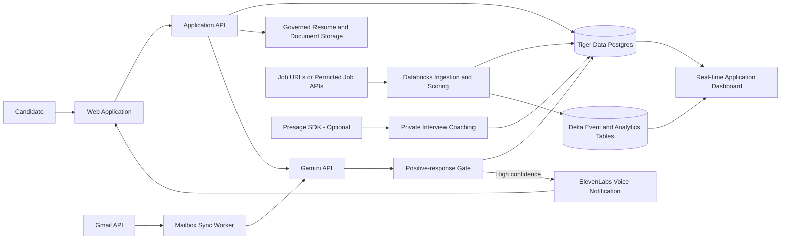

# Automated Job Application and Response Intelligence Platform

## 1. Purpose

This document describes a platform that helps a candidate discover relevant jobs, prepare truthful application materials, review and submit applications, monitor employer email responses, and receive an immediate in-app voice notification when a positive response arrives.

The system is designed for a hackathon prototype. It prioritizes a coherent user experience and meaningful sponsor integrations over using every available technology.

## 2. Goals

- Convert a resume into a structured candidate profile.
- Ingest or accept job descriptions and calculate explainable job-match scores.
- Generate tailored, evidence-backed application materials.
- Require candidate approval before any external submission.
- Monitor Gmail for responses connected to tracked applications.
- Classify responses into interview, assessment, recruiter follow-up, offer, rejection, neutral, or uncertain.
- Generate an ElevenLabs in-app spoken notification when a high-confidence positive response arrives.
- Track the complete application lifecycle and display real-time funnel analytics.

## 3. Non-goals

- Bypassing CAPTCHAs or job-board protections.
- Submitting fabricated qualifications or experience.
- Uncontrolled mass application submission.
- Automatically replying to recruiters in the initial release.
- Using physiological or emotional signals to make hiring decisions.
- Adding blockchain or additional databases solely for prize eligibility.

## 4. Recommended Sponsor Stack

### Core integrations

| Technology | Role | Why it is meaningful |
|---|---|---|
| Gemini API | Resume and job parsing, match explanations, document drafting, and email-response classification | The product depends on multimodal and structured language understanding. |
| ElevenLabs | In-app positive-response narration and optional voice interview coach | Voice is a primary user-facing workflow, not a decorative add-on. |
| Tiger Data | PostgreSQL system of record plus time-series application events and real-time dashboard aggregates | The platform combines relational candidate data with a high-frequency lifecycle event stream. |
| GoDaddy Registry | Custom domain for the deployed application | Useful, inexpensive, and visible in the demo. |

### Optional integration

| Technology | Role | Constraint |
|---|---|---|
| Presage | Candidate-only interview coaching using opt-in engagement, breathing, or stress indicators | Results must be private coaching signals and must never influence employer-side decisions. |

### Do not use in the initial architecture

| Technology | Reason |
|---|---|
| Solana | The workflow does not require payments, decentralized identity, asset ownership, or public consensus. A consent hash on-chain would add complexity without improving the user outcome. |
| MongoDB Atlas | Tiger Data already supplies the operational relational store and event analytics. A second application database creates synchronization work without a distinct requirement. |
| Vultr | Databricks Apps can host the application. Vultr is viable only if the team chooses a standalone deployment instead of Databricks hosting. |

## 5. Tiger Data, Not Tiger Analytics

The hackathon category refers to **Tiger Data**, the PostgreSQL and time-series platform, not Tiger Analytics, the consulting and analytics company.

Tiger Data is a strong fit because the system has both conventional relational records and a timestamped stream of state changes:

- Relational data: users, resumes, jobs, applications, approvals, Gmail connections, and notification preferences.
- Time-series data: job discoveries, match scores, application transitions, incoming email classifications, notification attempts, and voice-session outcomes.
- Real-time aggregates: applications by stage, positive-response rate, median time to response, voice notifications played, and classification confidence over time.

For the hackathon, Tiger Data should be the primary operational database. Databricks remains the workflow, AI/data processing, governance, and deeper analytics layer.

## 6. High-level Architecture



## 7. Component Responsibilities

### 7.1 Web application

The application can be implemented as a Databricks App with a React frontend and backend API.

Primary screens:

- Candidate onboarding and resume upload
- Job feed and explainable matches
- Application-material review
- Submission approval
- Application tracker
- Positive-response inbox
- Voice notification settings
- Mock interview and feedback
- Application funnel analytics

### 7.2 Application API

The API owns all privileged operations:

- Candidate and job CRUD
- OAuth connection management
- Gemini request validation
- Approval enforcement
- Submission idempotency
- Notification policy and quiet hours
- ElevenLabs voice-notification creation
- Audit-event creation

The language model may recommend actions, but only the API may execute them.

### 7.3 Tiger Data

Tiger Data stores the current application state and the lifecycle event stream.

Conventional PostgreSQL tables:

- `users`
- `candidate_profiles`
- `resumes`
- `job_preferences`
- `jobs`
- `job_matches`
- `applications`
- `application_documents`
- `submission_approvals`
- `gmail_connections`
- `notification_preferences`

Time-series/event tables:

- `application_events`
- `email_classification_events`
- `submission_attempt_events`
- `notification_events`
- `voice_notification_events`
- `interview_session_events`

Continuous aggregates can power:

- Application counts by stage and day
- Positive-response rate by company or role
- Median time from submission to response
- Email-classification confidence distribution
- Voice-notification generation and playback rate

### 7.4 Databricks

Databricks provides:

- Job ingestion and normalization workflows
- Batch or scheduled match-score computation
- Governed storage for resumes and generated documents
- Append-oriented analytics history in Delta tables
- Model and prompt evaluation datasets
- Dashboard or application analytics

Lakeflow Jobs can orchestrate ingestion, normalization, scoring, and reconciliation. Tiger Data remains the low-latency operational database used by the web application.

### 7.5 Gemini

Gemini is used through bounded, structured operations:

```text
extract_candidate_profile(resume) -> CandidateProfile
extract_job_requirements(job_description) -> JobRequirements
explain_match(candidate, job, deterministic_score) -> MatchExplanation
generate_application_packet(candidate, job) -> DraftPacket
classify_employer_email(email, application_context) -> EmailClassification
```

Outputs must follow application-defined schemas and be validated before storage or action.

The numerical match score should be deterministic. Gemini explains the score and generates content, but it should not invent the score or unsupported candidate claims.

### 7.6 Gmail connector

Hackathon implementation:

- Connect one Gmail account with OAuth.
- Request the narrowest read scope that supports the demo.
- Poll for unread messages every 60 to 120 seconds.
- Process each Gmail message ID once.

Production implementation:

- Use Gmail `watch` with Google Cloud Pub/Sub.
- Retrieve changes using Gmail history APIs.
- Renew watches before expiration.
- Run periodic reconciliation for delayed or dropped notifications.

The connector matches each email to an application using the sender domain, company name, role title, requisition ID, prior thread, and timing.

### 7.7 Positive-response detector

The detector uses deterministic evidence followed by Gemini classification.

Supported outcomes:

- `interview_requested`
- `assessment_requested`
- `recruiter_followup`
- `offer`
- `rejection`
- `neutral`
- `unrelated`
- `uncertain`

Example structured result:

```json
{
  "application_id": "app_123",
  "category": "interview_requested",
  "direction": "positive",
  "confidence": 0.96,
  "evidence": [
    "We would like to schedule a technical interview"
  ],
  "suggested_action": "Select an interview time"
}
```

A voice notification is generated only when:

- The email matches exactly one tracked application.
- The category is on the positive allowlist.
- Confidence meets the configured threshold, initially `0.90`.
- The Gmail message has not been processed previously.
- Voice notifications are enabled.

Uncertain messages appear in the application dashboard without generating a spoken alert.

### 7.8 ElevenLabs notification agent

The backend supplies dynamic notification context:

- Candidate first name
- Company and role
- Response category
- Evidence-backed summary
- Required next action
- Application dashboard URL

The initial agent can inform and summarize. It cannot reply to recruiters, schedule an interview, or change application state.

Example opening:

> Good news. Your application for the software engineering role at Acme received an interview request. The recruiter asked you to choose a time. The details are available in your application dashboard.

The application presents the notification through an ElevenLabs-powered in-app voice experience. Every generation and playback outcome is written to `voice_notification_events`.

### 7.9 Presage interview coach (optional)

During a mock interview, Presage can collect opt-in camera-derived signals such as engagement, breathing rate, or movement. These signals can help the candidate identify moments of stress or loss of focus.

Safeguards:

- Explicit opt-in before camera activation
- Visible recording/measurement indicator
- Candidate-only results
- No employer access
- No use in match scoring or hiring recommendations
- Clear statement that wellness signals are not medical diagnoses
- Raw video should not be retained by default

## 8. Core Workflows

### 8.1 Application preparation

```text
Resume upload
  -> Gemini structured extraction
  -> Candidate confirms profile
  -> Job ingestion
  -> Deterministic match score
  -> Gemini explanation and draft materials
  -> Candidate review
  -> Approval record
  -> Authorized submission or user-assisted handoff
```

### 8.2 Employer-response notification

```text
Gmail change detected
  -> Fetch message
  -> Deduplicate by Gmail message ID
  -> Match to tracked application
  -> Sanitize untrusted email content
  -> Gemini structured classification
  -> Apply confidence and category rules
  -> Store classification event in Tiger Data
  -> Generate ElevenLabs voice notification when eligible
  -> Store generation and playback result
```

### 8.3 Application state machine

```text
DISCOVERED
  -> SHORTLISTED
  -> MATERIALS_GENERATED
  -> READY_FOR_REVIEW
  -> APPROVED
  -> SUBMITTING
      -> SUBMITTED
      -> NEEDS_USER_ACTION
      -> FAILED
  -> INTERVIEW
  -> OFFER | REJECTED | WITHDRAWN
```

## 9. Security and Trust

- Encrypt OAuth refresh tokens and API credentials.
- Never expose Gmail, Gemini, ElevenLabs, or database secrets to the browser.
- Treat resumes, job descriptions, and emails as untrusted model input.
- Defend against prompt injection in externally sourced job descriptions and email bodies.
- Never use email content to train a generalized model.
- Retain the minimum message content required for the user-facing feature.
- Provide Gmail disconnect and data-deletion controls.
- Require explicit approval before application submission.
- Use idempotency keys for submissions and voice notifications.
- Keep a timestamped audit record of every automated decision and external action.
- Do not log full resumes, OAuth tokens, or complete email bodies in general application logs.

## 10. Hackathon MVP

Build the following vertical slice:

1. Upload one resume.
2. Parse it with Gemini into a confirmed profile.
3. Paste or upload several job descriptions.
4. Rank jobs with an explainable score.
5. Generate a tailored application packet.
6. Track a simulated or user-assisted submission.
7. Connect one Gmail test account.
8. Poll for employer responses.
9. Classify a positive interview email with Gemini.
10. Write application and email events to Tiger Data.
11. Generate and play an ElevenLabs in-app voice notification.
12. Show the state change immediately on a dashboard.
13. Deploy under a custom GoDaddy domain if time permits.

Optional only after the full vertical slice works:

14. Add a Presage-enhanced mock interview.

## 11. Demonstration Script

1. Show a candidate profile produced from a resume.
2. Show several job matches and explain one score.
3. Generate and approve an application packet.
4. Display the application entering the submitted state.
5. Inject or receive a realistic recruiter interview email.
6. Show Gemini's structured classification and supporting evidence.
7. Show the new event appearing in the Tiger Data-backed dashboard.
8. Open the ElevenLabs voice alert and hear the job-specific notification.
9. Show the playback event and updated application status.
10. If implemented, run a short opt-in Presage interview-coaching segment.

## 12. Success Metrics

- Resume and job extraction schema-validity rate
- Email-to-application match accuracy
- Positive-response classification precision
- Duplicate-notification prevention rate
- Time from Gmail receipt to voice-notification readiness
- Voice-notification generation and playback rate
- Median time required to prepare an application packet
- Percentage of generated claims backed by resume evidence
- User override rate for model classifications

## 13. Primary Risks

| Risk | Mitigation |
|---|---|
| False positive triggers a misleading voice alert | Category allowlist, high confidence threshold, deterministic evidence, and manual review for uncertainty |
| Email cannot be mapped to an application | Do not generate an alert; place it in an unmatched review queue |
| Duplicate Gmail notifications | Unique constraint on Gmail message ID and idempotent processing |
| Duplicate voice notifications | Unique notification idempotency key and terminal notification states |
| Gemini fabricates candidate information | Source-backed claims, schema validation, and candidate approval |
| Sponsor integrations feel superficial | Demonstrate each technology in the primary end-to-end workflow |
| Too many systems for the weekend | Complete Gemini, Tiger Data, and ElevenLabs first; add GoDaddy and Presage afterward |

## 14. Recommended Prize Submissions

Primary targets:

- Best Use of Gemini API
- Best Use of ElevenLabs
- Best Use of Tiger Data
- Best Domain Name from GoDaddy Registry

Conditional target:

- Best Use of Presage, only if the private interview-coaching feature is complete and thoughtfully explained

Avoid submitting for a category when the sponsor technology is merely mentioned or included without affecting the core experience.

## 15. References

- VTHacks prize descriptions: https://www.mlh.com/events/vthacks-14/prizes
- Gemini structured outputs: https://ai.google.dev/gemini-api/docs/structured-output
- Gmail push notifications: https://developers.google.com/workspace/gmail/api/guides/push
- ElevenLabs Speech Engine: https://elevenlabs.io/docs/overview/capabilities/speech-engine
- Databricks Apps: https://docs.databricks.com/aws/en/dev-tools/databricks-apps
- Lakeflow Jobs: https://docs.databricks.com/aws/en/jobs
